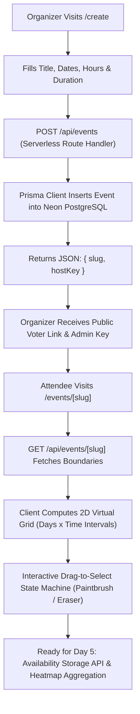

# 📘 SyncLock: Master Engineering Handbook & Learning Notes (Days 1 – 4)

A comprehensive, in-depth technical manual documenting the full architectural design, mathematical models, database schemas, API routes, React state engines, and real-world debugging case studies for **SyncLock** (A full-stack Next.js, TypeScript, Prisma & PostgreSQL group scheduling platform).

---

# 📑 Master Table of Contents
1. [Day 1: Architectural Foundations, The Problem Space & System Design](#day-1-architectural-foundations-the-problem-space--system-design)
   - 1.1 The Scheduling Landscape & When2meet Failure Modes
   - 1.2 The SyncLock 5-Stage Lifecycle
   - 1.3 Relational Domain Modeling & Entity Boundaries
   - 1.4 The UTC Invariant: Why Date Math Fails Without Standardization
   - 1.5 Technology Stack Evaluation & Selection Rationale
   - 1.6 Day 1 Architectural Self-Verification
2. [Day 2: Cloud Database Infrastructure & Prisma Schema Engineering](#day-2-cloud-database-infrastructure--prisma-schema-engineering)
   - 2.1 Serverless PostgreSQL Architecture & Connection Pooling on Neon
   - 2.2 Prisma Schema Language (PSL) vs. TypeScript (Grammar & Rules)
   - 2.3 The 6 Core Relational Models (Line-by-Line `contract.prisma`)
   - 2.4 Referential Integrity, Foreign Keys, and Cascade Deletions
   - 2.5 The Date Engine Trap: `DateTime` vs `Temporal.Instant` vs `TimestamptzString`
   - 2.6 The Prisma CLI Lifecycle: Contracts, Emission, and Database Synchronization
   - 2.7 Case Study & Debugging Log: Real Errors Solved on Day 2
3. [Day 3: Backend API Architecture & Event Creation UI](#day-3-backend-api-architecture--event-creation-ui)
   - 3.1 Next.js App Router Architecture: The Hybrid Server/Client Paradigm
   - 3.2 The Event Creation API (`app/api/events/route.ts`) Line-by-Line Breakdown
   - 3.3 Cryptographic Security: Unguessable Slugs & Host Administrative Tokens
   - 3.4 The Event Creation Frontend (`app/create/page.tsx`) Line-by-Line Breakdown
   - 3.5 State Management, Two-State Views, and Micro-Interactions
   - 3.6 UI Design Evolution: Eradicating "AI-Generated" Clichés for Linear-Grade UI
   - 3.7 Day 3 Self-Verification Quiz & Code Mechanics
4. [Day 4: The Virtual Time Grid & Interactive Drag-Selection Engine](#day-4-the-virtual-time-grid--interactive-drag-selection-engine)
   - 4.1 Dynamic Routing Mechanics in Next.js 15/16 (`[slug]` & Async `params`)
   - 4.2 The Event Detail API Route (`app/api/events/[slug]/route.ts`) Line-by-Line
   - 4.3 Architectural Bug Analysis: The Next.js Route Conflict Error
   - 4.4 The 2D Virtual Grid Algorithm: Mathematical Formulation & Generator
   - 4.5 The Drag-to-Select State Machine: Paintbrush vs. Eraser Pattern
   - 4.6 The Global Window MouseUp Listener Pattern
   - 4.7 Performance Engineering: $O(1)$ Hash Set vs. $O(N)$ Array Scanning
   - 4.8 The Complete Voting Page (`app/events/[slug]/page.tsx`) Line-by-Line
   - 4.9 Day 4 Algorithmic Trace & Self-Verification
5. [Master Reference: Schema, Types, and System Maps](#master-reference-schema-types-and-system-maps)

---

# Day 1: Architectural Foundations, The Problem Space & System Design

## 1.1 The Scheduling Landscape & When2meet Failure Modes

To understand why SyncLock exists, we must analyze the operational breakdown of traditional group scheduling platforms, most notably **When2meet**.

```
┌────────────────────────────────────────────────────────────────────────┐
│                   THE TRADITIONAL WHEN2MEET DEAD END                   │
├────────────────────────────────────────────────────────────────────────┤
│  1. Create Poll ──> 2. Share Link ──> 3. Vote Grid ──> 4. View Heatmap │
│                                                              ▲         │
│                                                              │         │
│               ❌ THE LIFECYCLE ABRUPTLY TERMINATES HERE!      │         │
│  - No slot locking mechanism                                           │
│  - No calendar invite generation (.ics / Google Calendar)              │
│  - No intake question collection (agendas, preparation notes)          │
│  - No attendee confirmation records                                    │
│  - No automated reminders (resulting in high no-show rates)            │
│  - Everything downstream must be executed manually across chat apps.   │
└────────────────────────────────────────────────────────────────────────┘
```

When2meet addresses only **one sub-problem** of coordination: *calculating the intersection of free time windows across a set of individuals*. 
However, an actual meeting is a multi-stage transaction:
1. **Coordination**: Finding when everyone can attend.
2. **Commitment**: The host selecting and locking a single definitive winning slot.
3. **Context Gathering**: Collecting prerequisite details from attendees.
4. **Calendar Synchronization**: Injecting the event into everyone's personal calendar systems.
5. **Execution & Accountability**: Sending reminders to guarantee attendance.

Traditional tools abandon the user at Stage 1, creating high friction where the host must manually text the group, create calendar events by hand, and email links individually.

---

## 1.2 The SyncLock 5-Stage Lifecycle

SyncLock replaces this fragmented process with an integrated, state-machine-driven pipeline:

```
┌─────────────────┐       ┌─────────────────┐       ┌─────────────────┐
│ Stage 1         │       │ Stage 2         │       │ Stage 3         │
│ DISCOVERY       │ ────> │ VOTING          │ ────> │ CONSENSUS       │
│ Host configures │       │ Attendees drag- │       │ Aggregation     │
│ date boundaries │       │ select slots on │       │ engine renders  │
│ & time windows. │       │ dynamic grid.   │       │ visual heatmap. │
└─────────────────┘       └─────────────────┘       └─────────────────┘
                                                           │
                                                           ▼
┌─────────────────┐       ┌─────────────────┐       ┌─────────────────┐
│ Stage 5         │       │ Stage 4b        │       │ Stage 4a        │
│ EXECUTION       │ <──── │ INTAKE          │ <──── │ LOCKING         │
│ Auto-generated  │       │ Dynamic forms   │       │ Host commits    │
│ .ics/Google Cal │       │ collect attendee│       │ winning slot.   │
│ & reminders.    │       │ agendas & info. │       │ Poll is frozen. │
└─────────────────┘       └─────────────────┘       └─────────────────┘
```

1. **Discovery (Event Creation)**: Host defines time boundaries (e.g., Oct 10–14, 9 AM – 5 PM, 30-min increments).
2. **Voting (Availability Ingestion)**: Participants drag-select their free slots. Data is ingested as atomic UTC timestamps.
3. **Consensus (Overlap Aggregation)**: The system computes the histogram of availability across all participants in real time.
4. **Locking (State Transition `POLLING` $\rightarrow$ `LOCKED`)**: The host selects a winning candidate slot. The event is locked, freezing the grid to prevent further modifications.
5. **Execution (Calendar & Intake Sync)**: Intake answers are bound to participant records, calendar objects (`.ics`) are emitted, and transactional confirmation emails are triggered.

---

## 1.3 Relational Domain Modeling & Entity Boundaries

A primary architecture question is: *Should availability be stored as a massive JSON blob on the event, or normalized into relational tables?*

### The Document vs. Relational Decision
- **Document Store (Single JSON document)**: Storing all votes in a giant nested JSON object `{ rahul: ["10:00", "10:30"], priya: ["10:30"] }` makes initial writes simple, but causes severe race conditions when two participants submit simultaneously. Overwriting the JSON blob leads to lost updates unless complex database document locking is implemented.
- **Normalized Relational Model (Our Choice)**: Storing each participant as an entity, and each selected availability interval as an atomic row (`Availability`), allows concurrent inserts without collision. Querying overlap is a simple SQL `GROUP BY` and `COUNT`:

$$\text{Overlap}(t) = \text{COUNT}(\text{participant\_id}) \quad \text{WHERE} \quad \text{slot\_time} = t$$

---

## 1.4 The UTC Invariant: Why Date Math Fails Without Standardization

One of the most catastrophic traps in scheduling software is **local timezone pollution**.

### The Failure Scenario
Consider an event created by a host in London:
- Participant A in New York (`UTC-4`) selects `10:00 AM`.
- Participant B in Mumbai (`UTC+5:30`) selects `7:30 PM`.
- If stored as raw naive strings (`"10:00"` and `"19:30"`), the database considers them completely different times.
- In reality:
  - New York `10:00 AM EDT` = `14:00:00 UTC`
  - Mumbai `7:30 PM IST` = `14:00:00 UTC`
  - **They selected the exact same physical moment in time!**

### The Core Architectural Rule:
> **The database and backend APIs must exclusively store and transmit timestamps in ISO-8601 UTC format (`YYYY-MM-DDTHH:mm:ss.sssZ`). Timezone conversion is strictly a view-layer responsibility executed in the user's browser via the JavaScript `Intl` or `Date` APIs.**

---

## 1.5 Technology Stack Evaluation & Selection Rationale

| Technology | Architectural Responsibility | Engineering Justification |
| :--- | :--- | :--- |
| **Next.js (App Router)** | Full-Stack Application Framework | Colocates backend serverless API endpoints (`/app/api/...`) with React Server and Client Components in a unified TypeScript codebase. |
| **TypeScript** | End-to-End Type Safety | Enforces strict contracts between database models, API JSON payloads, and React UI props. Prevents runtime `undefined` errors. |
| **PostgreSQL (Neon)** | ACID-Compliant Relational Database | Relational foreign keys and cascade deletions guarantee that no orphaned votes or answers remain if an event is modified. |
| **Prisma ORM** | Data Layer & Query Builder | Provides compile-time type-checked database queries and automated database migration management. |
| **Tailwind CSS** | Styling & UI System | Utility-first styling enables high-performance UI rendering without bloated CSS bundles. |

---

## 1.6 Day 1 Architectural Self-Verification

1. **Why does an event need two separate URLs (Public vs. Host Admin)?**
   - *Answer*: If there were only one URL, any participant could lock the final meeting, delete the event, or view private intake data. The public slug provides read/vote access; the host key grants administrative state transitions.
2. **What occurs if a user submits availability for a slot outside the event's configured daily hours?**
   - *Answer*: The API layer must validate incoming slot timestamps against the event's `startDate`, `endDate`, `startHour`, and `endHour` before writing to PostgreSQL, rejecting malformed payloads with HTTP 400.

---

# Day 2: Cloud Database Infrastructure & Prisma Schema Engineering

## 2.1 Serverless PostgreSQL Architecture & Connection Pooling on Neon

Traditional PostgreSQL databases maintain long-lived stateful TCP connections. In a serverless architecture like Next.js App Router:
- Each incoming HTTP request can spin up an isolated serverless function instance.
- If 100 people vote simultaneously, 100 function instances attempt to open 100 direct PostgreSQL connections.
- Standard PostgreSQL instances exhaust connection pools quickly (`FATAL: too many connections`).

### The Neon Solution: Connection Pooling via PgBouncer
Neon provides a dedicated pooled endpoint indicated by `-pooler` in the hostname:
```env
DATABASE_URL="postgresql://[user]:[password]@[endpoint]-pooler.[region].aws.neon.tech/[dbname]?sslmode=require"
```
Behind the scenes, PgBouncer maintains a warm pool of reusable connections to PostgreSQL, allowing thousands of serverless requests to share a small set of database connections safely.

---

## 2.2 Prisma Schema Language (PSL) vs. TypeScript (Grammar & Rules)

A common point of confusion for beginners is syntax mixing between TypeScript and Prisma's Schema Definition Language:

```
┌─────────────────────────────────┬─────────────────────────────────┐
│     TypeScript Syntax           │    Prisma PSL Syntax            │
├─────────────────────────────────┼─────────────────────────────────┤
│ let id: string;                 │ id String                       │
│ (Uses colon `:`)                │ (NO colons allowed!)            │
├─────────────────────────────────┼─────────────────────────────────┤
│ const role = "ADMIN";           │ role Role @default(ADMIN)       │
│ (Strings use quotes)            │ (Enum defaults have NO quotes!) │
├─────────────────────────────────┼─────────────────────────────────┤
│ id: number = uuid();            │ id String @default(uuid())      │
│ (Type mismatch)                 │ (UUIDs are ALWAYS Strings)      │
└─────────────────────────────────┴─────────────────────────────────┘
```

---

## 2.3 The 6 Core Relational Models (Line-by-Line `contract.prisma`)

Here is the complete schema from `src/prisma/contract.prisma`, followed by an exhaustive breakdown of every field:

```prisma
// use prisma-8
enum EventStatus {
  POLLING
  ACTIVE
  COMPLETED
  CANCELLED
}

model Event {
  id              String           @id @default(uuid())
  title           String
  description     String?
  slug            String           @unique
  hostKey         String?          @unique
  duration        Int
  startDate       TimestamptzString
  endDate         TimestamptzString
  startHour       Int
  endHour         Int
  status          EventStatus      @default(POLLING)
  inviteeLimit    Int
  location        String
  hostName        String
  participants    Participant[]
  booking         Booking?
  intakeQuestions IntakeQuestion[]
}

model Participant {
  id             String         @id @default(uuid())
  name           String
  email          String?
  eventId        String
  event          Event          @relation(fields: [eventId], references: [id], onDelete: Cascade)
  availabilities Availability[]
  answers        IntakeAnswer[]
}

model Availability {
  id            String            @id @default(uuid())
  slotTime      TimestamptzString
  participantId String
  participant   Participant       @relation(fields: [participantId], references: [id], onDelete: Cascade)
}

model Booking {
  id          String            @id @default(uuid())
  eventId     String            @unique
  event       Event             @relation(fields: [eventId], references: [id], onDelete: Cascade)
  startTime   TimestamptzString
  endTime     TimestamptzString
  meetingLink String?
}

model IntakeQuestion {
  id         String         @id @default(uuid())
  eventId    String
  event      Event          @relation(fields: [eventId], references: [id], onDelete: Cascade)
  question   String
  isRequired Boolean        @default(false)
  answers    IntakeAnswer[]
}

model IntakeAnswer {
  id            String         @id @default(uuid())
  questionId    String
  question      IntakeQuestion @relation(fields: [questionId], references: [id], onDelete: Cascade)
  participantId String
  participant   Participant    @relation(fields: [participantId], references: [id], onDelete: Cascade)
  answer        String
}
```

### Detailed Field-by-Field Architectural Breakdown

#### 1. Model `Event`
- `id String @id @default(uuid())`: Primary key generated as an unguessable UUIDv4.
- `slug String @unique`: An 8-character public URL token (e.g. `3a8f9c1b`). Indexed with a unique constraint so lookups (`WHERE slug = ?`) run in $O(1)$ logarithmic index time.
- `hostKey String? @unique`: A 32-character secret cryptographic token. Only the organizer receives this, granting admin rights.
- `startDate / endDate TimestamptzString`: Represents the boundary dates of the poll.
- `startHour / endHour Int`: Integers `0–23` representing the daily active time window (e.g. `9` to `17`).
- `status EventStatus @default(POLLING)`: State machine tracker. Begins in `POLLING` mode and transitions to `ACTIVE`/`COMPLETED` upon booking lock.
- `participants Participant[]`: One-to-Many virtual relation array connecting attendees to this event.
- `booking Booking?`: Zero-or-One virtual relation. An event has no booking while polling, and exactly one when locked.

#### 2. Model `Participant`
- `email String?`: Notice the deliberate **omission of `@unique`**! If `@unique` was attached, a user with email `rahul@gmail.com` could only ever participate in **one single event in the history of the application**. Omitting `@unique` allows attendees to vote across unlimited events.
- `eventId String`: Foreign key column storing the parent event's ID.

#### 3. Model `Availability`
- `slotTime TimestamptzString`: The exact UTC timestamp representing the start of a free interval (e.g., `2026-10-12T14:30:00.000Z`).
- `participantId String`: Foreign key linking this free block to the person who voted for it.

#### 4. Model `Booking`
- `eventId String @unique`: The unique constraint on `eventId` enforces a strict **1-to-1 relationship** at the database engine level. An event can never accidentally have two conflicting confirmed bookings.

---

## 2.4 Referential Integrity, Foreign Keys, and Cascade Deletions

Notice the attribute attached to every relation:
```prisma
@relation(fields: [eventId], references: [id], onDelete: Cascade)
```

### Why `onDelete: Cascade` is Critical
In a relational database, referential integrity rules prevent creating child rows that point to non-existent parents.
- Without `onDelete: Cascade`: If a host decides to delete an event, PostgreSQL halts with a foreign key violation error: `Key (id)=(...) is still referenced from table "participant"`.
- With `onDelete: Cascade`: Instructs PostgreSQL that if an `Event` row is deleted, the database engine automatically deletes all corresponding `Participant`, `Availability`, `Booking`, and `IntakeAnswer` rows in a single atomic transaction.

---

## 2.5 The Date Engine Trap: `DateTime` vs `Temporal.Instant` vs `TimestamptzString`

During Day 2 and Day 3, we encountered a significant TypeScript compiler failure:
```
error TS2304: Cannot find name 'Temporal'.
startDate: Temporal.Instant.from(new Date(startDate).toISOString())
```

### The Root Cause:
Prisma 8 introduced native support for the emerging ECMAScript **Temporal API** (the eventual replacement for JavaScript's flawed `Date` object).
- When a model field is declared as `DateTime` in Prisma 8, the contract compiler expects instances of `Temporal.Instant`.
- However, the `Temporal` global is not yet standard in Node.js LTS or browsers without experimental flags or massive polyfills.

### The Engineering Solution:
Prisma 8 provides the **`TimestamptzString`** codec:
- **In PostgreSQL**: The column is created as a native, optimized `timestamptz` (timestamp with timezone).
- **In TypeScript**: The type resolves cleanly to a standard JavaScript `string`.
- This enables using clean ISO strings (`new Date().toISOString()`) across Next.js APIs, React components, and database queries without type errors or polyfills.

---

## 2.6 The Prisma CLI Lifecycle: Contracts, Emission, and Database Synchronization

The developer workflow in modern Prisma involves three distinct operations:

```
                  ┌──────────────────────────────────────────────┐
                  │          src/prisma/contract.prisma          │
                  │           (Human-authored schema)            │
                  └──────────────────────┬───────────────────────┘
                                         │
                                         ▼ (npx prisma contract format)
                  ┌──────────────────────────────────────────────┐
                  │  Syntax Check & Canonical Code Formatting    │
                  └──────────────────────┬───────────────────────┘
                                         │
                                         ▼ (npx prisma contract emit)
                  ┌──────────────────────────────────────────────┐
                  │       Contract Artifact Generation           │
                  │  - contract.json (Runtime contract metadata) │
                  │  - contract.d.ts (Compile-time TS types)     │
                  └──────────────────────┬───────────────────────┘
                                         │
                                         ▼ (npx prisma db update)
                  ┌──────────────────────────────────────────────┐
                  │       Live Cloud Database Synchronization    │
                  │  Executes DDL on Neon PostgreSQL instance.   │
                  │  Tables, indexes, and foreign keys created.  │
                  └──────────────────────────────────────────────┘
```

---

## 2.7 Case Study & Debugging Log: Real Errors Solved on Day 2

### Case Study 1: The Accidental Unsaved Buffer Trap
- **Symptom**: CLI commands continued reporting syntax errors despite the developer having typed the fixes into VS Code.
- **Root Cause**: In VS Code, editing a file does not write bytes to disk until saved (`Cmd + S`). The CLI reads from disk, not the editor's RAM buffer.
- **Resolution**: Enabled `File -> Auto Save` in VS Code and confirmed the white unsaved dot `●` disappeared before running CLI commands.

### Case Study 2: The Multi-Line Environment Variable Malformation
- **Symptom**: Database connection errors when reading `DATABASE_URL`.
- **Root Cause**: The closing quotation mark had been accidentally pushed to line 2 in `.env`:
  ```env
  DATABASE_URL="postgresql://...neon.tech/neondb?sslmode=require
  "
  ```
  The parser read a literal newline character `\n` into the connection string, corrupting host resolution.
- **Resolution**: Consolidated the entire string onto a single line.

---

# Day 3: Backend API Architecture & Event Creation UI

## 3.1 Next.js App Router Architecture: The Hybrid Server/Client Paradigm

Next.js App Router splits execution into two worlds:

```
┌───────────────────────────────────────┐   ┌───────────────────────────────────────┐
│           SERVER ENVIRONMENT          │   │           CLIENT ENVIRONMENT          │
├───────────────────────────────────────┤   ├───────────────────────────────────────┤
│ - Executes in Node.js runtime         │   │ - Executes in user's Web Browser      │
│ - Has direct access to DB credentials │   │ - Has NO access to DB credentials     │
│ - Zero JavaScript sent to browser     │   │ - Handles DOM events, state & typing  │
│ - Code in: app/api/.../route.ts       │   │ - Declared with: 'use client'         │
└───────────────────────────────────────┘   └───────────────────────────────────────┘
                   │                                           ▲
                   │           HTTP JSON Network Bridge        │
                   └───────────────────────────────────────────┘
```

When building the Event Creation flow:
1. The user interacts with a **Client Component** (`app/create/page.tsx`) to type event parameters.
2. The Client Component makes a network `POST` request over HTTP.
3. The **Server Route Handler** (`app/api/events/route.ts`) validates the payload, queries PostgreSQL, and returns JSON.

---

## 3.2 The Event Creation API (`app/api/events/route.ts`) Line-by-Line Breakdown

Here is the complete implementation of `app/api/events/route.ts`:

```typescript
// Line 1: Import cryptographic randomness from Node.js standard library
import { randomBytes } from 'crypto';
// Line 2: Import our type-safe database client
import { db } from '@/src/prisma/db';

// Line 4: Export named POST handler matching HTTP POST method
export async function POST(req: Request) {
  try {
    // Line 6: Asynchronously parse the incoming JSON request stream
    const body = await req.json();

    // Lines 8-19: Destructure expected payload fields
    const {
      title, 
      description, 
      hostName, 
      location, 
      startDate, 
      endDate, 
      startHour, 
      endHour, 
      duration, 
      inviteeLimit, 
    } = body;

    // Line 21-26: Guard clause - Validate essential non-nullable fields
    if (!title || !hostName || !startDate || !endDate) {
      return Response.json(
        { error: "Missing required fields (title, hostName, startDate, endDate)" },
        { status: 400 } // 400 Bad Request indicates client validation failure
      );
    }

    // Lines 28-31: Type coercion & default value fallback
    // Guarantees string representations from HTML inputs are converted to valid integers
    const parsedStartHour = Number(startHour ?? 9);
    const parsedEndHour = Number(endHour ?? 17);
    const parsedDuration = Number(duration ?? 30);
    const parsedInviteeLimit = Number(inviteeLimit ?? 20);

    // Line 33-38: Business logic validation - start must precede end
    if (parsedStartHour >= parsedEndHour) {
      return Response.json(
        { error: "Start hour must be earlier than end hour" },
        { status: 400 }
      );
    }

    // Line 39-40: Cryptographic identifier generation
    const slug = randomBytes(4).toString('hex');   // 8-character hex string (e.g., "7f3a9b1c")
    const hostKey = randomBytes(16).toString('hex'); // 32-character hex token

    // Line 42-56: Database insertion via Prisma 8 Client
    const newEvent = await db.orm.public.Event.create({
      title: title.trim(),
      description: description ? description.trim() : null,
      hostName: hostName.trim(),
      location: location ? location.trim() : 'Online',
      startDate: new Date(startDate).toISOString(),
      endDate: new Date(endDate).toISOString(),
      startHour: parsedStartHour,
      endHour: parsedEndHour,
      duration: parsedDuration,
      inviteeLimit: parsedInviteeLimit,
      slug,
      hostKey,
    });

    // Line 58-66: Return success response with HTTP 201 Created
    return Response.json(
      {
        success: true,
        slug: newEvent.slug,
        hostKey: newEvent.hostKey,
        eventId: newEvent.id,
      },
      { status: 201 }
    );
  } catch (error) {
    // Line 68-73: Global error boundary for server crashes
    console.error('Error creating event:', error);
    return Response.json(
      { error: 'Internal Server Error: Failed to create event' },
      { status: 500 }
    );
  }
}
```

---

## 3.3 Cryptographic Security: Unguessable Slugs & Host Administrative Tokens

Why did we use `crypto.randomBytes` instead of auto-incrementing numbers like `/events/1` or `/events/2`?

1. **Enumeration Attack Prevention**: With sequential IDs, any visitor could increment the URL counter and view every meeting title, participant list, and private intake note across the entire platform.
2. **Entropy Analysis**:
   - `randomBytes(4).toString('hex')` generates a 32-bit random number represented as 8 hexadecimal characters. That provides $16^8 \approx 4.29 \text{ billion}$ possible combinations, making brute-force guessing unfeasible for general voting links.
   - `randomBytes(16).toString('hex')` generates a 128-bit random token ($16^{32} \approx 3.4 \times 10^{38}$ combinations). This cryptographic entropy is equivalent to high-security API keys, ensuring no one can forge a host key.

---

## 3.4 The Event Creation Frontend (`app/create/page.tsx`) Line-by-Line Breakdown

The creation page at `app/create/page.tsx` manages the form lifecycle:

```typescript
'use client'; // Declares this component executes in the client browser runtime

import { useState } from 'react';
import Link from 'next/link';

interface CreatedEvent {
  slug: string;
  hostKey: string;
  eventId: string;
}

// Preset arrays for quick-selection pills
const DURATIONS = [15, 30, 45, 60];
const LOCATIONS = ['Google Meet', 'Zoom', 'In Person', 'Phone Call'];

export default function CreateEventPage() {
  // Unified form state object
  const [formData, setFormData] = useState({
    title: '',
    description: '',
    hostName: '',
    location: 'Google Meet',
    startDate: '',
    endDate: '',
    startHour: 9,
    endHour: 17,
    duration: 30,
    inviteeLimit: 20,
  });

  const [isLoading, setIsLoading] = useState(false);
  const [errorMessage, setErrorMessage] = useState<string | null>(null);
  
  // When null: renders Form View. When populated: renders Success View.
  const [createdEvent, setCreatedEvent] = useState<CreatedEvent | null>(null);
  const [copiedType, setCopiedType] = useState<'public' | 'admin' | null>(null);

  // Generic controlled input handler
  const handleChange = (
    e: React.ChangeEvent<HTMLInputElement | HTMLTextAreaElement | HTMLSelectElement>
  ) => {
    const { name, value } = e.target;
    setFormData((prev) => ({ ...prev, [name]: value }));
  };

  const handleSubmit = async (e: React.FormEvent) => {
    e.preventDefault(); // Suppresses default browser HTML page reload
    setIsLoading(true);
    setErrorMessage(null);

    // Client-side pre-flight validation
    if (new Date(formData.startDate) > new Date(formData.endDate)) {
      setErrorMessage('End date cannot be earlier than start date.');
      setIsLoading(false);
      return;
    }

    try {
      // Dispatches asynchronous network POST to our backend route handler
      const response = await fetch('/api/events', {
        method: 'POST',
        headers: { 'Content-Type': 'application/json' },
        body: JSON.stringify(formData),
      });

      const data = await response.json();
      if (!response.ok) throw new Error(data.error || 'Failed to create event');

      // State transition triggers switch to Success View
      setCreatedEvent(data);
    } catch (err: unknown) {
      setErrorMessage(err instanceof Error ? err.message : 'An error occurred.');
    } finally {
      setIsLoading(false);
    }
  };
...
```

---

## 3.5 State Management, Two-State Views, and Micro-Interactions

Instead of creating a separate `/success` route, `app/create/page.tsx` uses a **Two-State View Pattern**:
- If `createdEvent === null`: Renders the form.
- If `createdEvent !== null`: Swaps the form for the published link drawer.

### Why this is superior UX:
- Avoids an unnecessary page transition and network reload.
- Keeps form memory accessible if the host wants to click "New Poll" and create another event.
- Prevents users from losing their secret host key through browser back-button navigation.

---

## 3.6 UI Design Evolution: Eradicating "AI-Generated" Clichés for Linear-Grade UI

During Day 3, we audited the initial UI and removed elements that looked like an automated AI template:
- **Removed**: Neon purple/pink gradients, bouncing emojis (`🎉`), glowing background blur spheres, and heavy marketing cards.
- **Adopted**: The **Linear / Notion Calendar** design philosophy:
  - Deep carbon `#09090b` primary buttons.
  - Soft neutral `#fafafa` workspace backdrop.
  - 1px crisp borders (`border-neutral-200/80`).
  - Native segmented pill selectors with smooth tactile transitions (`active:scale-[0.99]`).

---

# Day 4: The Virtual Time Grid & Interactive Drag-Selection Engine

## 4.1 Dynamic Routing Mechanics in Next.js 15/16 (`[slug]` & Async `params`)

Next.js uses folder-name bracket notation to represent parameterized URLs:
- File path: `app/events/[slug]/page.tsx`
- Matches URLs: `/events/3a8f9c1b`, `/events/team-sync`, etc.

### Next.js 15+ Async Params Requirement
In Next.js 15 and 16, route parameters are asynchronous Promises:
- **In Server Handlers**:
  ```typescript
  export async function GET(req: Request, { params }: { params: Promise<{ slug: string }> }) {
    const { slug } = await params;
  }
  ```
- **In Client Components**:
  ```typescript
  import { useParams } from 'next/navigation';
  const params = useParams();
  const slug = params?.slug as string;
  ```

---

## 4.2 The Event Detail API Route (`app/api/events/[slug]/route.ts`) Line-by-Line

Before the voter grid can render, it must fetch event boundaries from Neon.

```typescript
import { db } from '@/src/prisma/db';

export async function GET(
  req: Request,
  { params }: { params: Promise<{ slug: string }> }
) {
  try {
    // 1. Await dynamic URL parameters
    const { slug } = await params;

    // 2. Query Neon PostgreSQL for the unique matching slug
    const event = await db.orm.public.Event
      .where({ slug })
      .first();

    // 3. Return 404 if slug is non-existent
    if (!event) {
      return Response.json(
        { error: `Event with slug "${slug}" not found` },
        { status: 404 }
      );
    }

    // 4. Return event configuration object with HTTP 200 OK
    return Response.json({ success: true, event }, { status: 200 });
  } catch (error) {
    console.error('Error fetching event:', error);
    return Response.json(
      { error: 'Internal Server Error: Failed to fetch event' },
      { status: 500 }
    );
  }
}
```

---

## 4.3 Architectural Bug Analysis: The Next.js Route Conflict Error

On Day 4, the terminal displayed this fatal error:
```
Error: Conflicting route and page at /api/events/[slug]
route at /api/events/[slug]/route and page at /api/events/[slug]/page
```

### The Root Cause:
The developer placed `page.tsx` inside `app/api/events/[slug]/` right next to `route.ts`.
In Next.js App Router:
- **`route.ts`** defines an API endpoint returning non-HTML data (JSON).
- **`page.tsx`** defines an HTML UI view.
A single folder cannot contain both, because Next.js cannot determine if a `GET` request should return the HTML UI document or the API JSON payload.

### The Resolution:
Separated responsibilities across directories:
- **API JSON Endpoint**: `app/api/events/[slug]/route.ts`
- **Frontend UI View**: `app/events/[slug]/page.tsx`

---

## 4.4 The 2D Virtual Grid Algorithm: Mathematical Formulation & Generator

The scheduling grid is a **2D Matrix** where:
$$\mathbf{M} \in \mathbb{R}^{R \times C}$$
Where:
- $C$ = Total Number of Columns (Distinct calendar days from `startDate` to `endDate`).
- $R$ = Total Number of Rows (Discrete time intervals within each day).

### 1. The Column Day Generator
```typescript
const days = useMemo(() => {
  if (!event) return [];
  const list: Date[] = [];
  const current = new Date(event.startDate);
  const end = new Date(event.endDate);

  // Normalize time to midnight so day comparisons are purely date-based
  current.setHours(0, 0, 0, 0);
  end.setHours(0, 0, 0, 0);

  while (current <= end) {
    list.push(new Date(current));
    current.setDate(current.getDate() + 1); // Advance day pointer
  }
  return list;
}, [event]);
```

### 2. The Row Interval Generator
Calculates the number of rows $R$:
$$R = \frac{(\text{endHour} - \text{startHour}) \times 60}{\text{duration}}$$

```typescript
const timeSlots = useMemo(() => {
  if (!event) return [];
  const slots: { hour: number; minute: number; label: string }[] = [];
  const startMins = event.startHour * 60;
  const endMins = event.endHour * 60;
  const step = event.duration || 30;

  for (let m = startMins; m < endMins; m += step) {
    const hour = Math.floor(m / 60);
    const minute = m % 60;
    const period = hour >= 12 ? 'PM' : 'AM';
    const displayHour = hour === 0 ? 12 : hour > 12 ? hour - 12 : hour;
    const displayMinute = minute < 10 ? `0${minute}` : `${minute}`;
    slots.push({
      hour,
      minute,
      label: `${displayHour}:${displayMinute} ${period}`,
    });
  }
  return slots;
}, [event]);
```

### 3. Unique Cell Key Formulation
Every cell at coordinate $(c, r)$ is uniquely identified by its ISO-8601 string:
```typescript
const getSlotKey = (day: Date, hour: number, minute: number) => {
  const d = new Date(day);
  d.setHours(hour, minute, 0, 0);
  return d.toISOString(); // e.g. "2026-10-12T09:30:00.000Z"
};
```

---

## 4.5 The Drag-to-Select State Machine: Paintbrush vs. Eraser Pattern

A simple `onClick` handler requires users to click 40 individual boxes to mark availability for a day. Drag-selection allows sweeping across cells in a single motion.

```
[ User presses MouseDown on Cell ]
               │
               ▼
   Is Cell currently selected?
     ├── YES ──> Set dragMode = "REMOVE" (Eraser Mode)
     └── NO  ──> Set dragMode = "ADD"    (Paintbrush Mode)
               │
               ▼
[ User Drags Mouse Across Cells (onMouseEnter) ]
     ├── If isMouseDown === true:
     │     ├── If dragMode === "ADD"    ──> Insert slotKey into Set
     │     └── If dragMode === "REMOVE" ──> Delete slotKey from Set
     └── If isMouseDown === false: Do nothing
               │
               ▼
[ User releases MouseUp ]
     └── Set isMouseDown = false
```

### The State Machine Implementation:
```typescript
const handleCellMouseDown = (slotKey: string) => {
  setIsMouseDown(true);
  const next = new Set(selectedSlots);

  if (next.has(slotKey)) {
    next.delete(slotKey);
    setDragMode('REMOVE'); // Initiates Eraser
  } else {
    next.add(slotKey);
    setDragMode('ADD');    // Initiates Paintbrush
  }
  setSelectedSlots(next);
};

const handleCellMouseEnter = (slotKey: string) => {
  if (!isMouseDown) return; // Ignore hover if mouse is not held down

  const next = new Set(selectedSlots);
  if (dragMode === 'ADD') {
    next.add(slotKey);
  } else {
    next.delete(slotKey);
  }
  setSelectedSlots(next);
};
```

---

## 4.6 The Global Window MouseUp Listener Pattern

### The Edge Case Trap:
1. User starts dragging inside the table.
2. User moves their cursor outside the browser window or outside the table.
3. User releases the mouse button.
4. User moves cursor back into the table.
5. **The table is stuck in dragging mode!** Because `onMouseUp` was attached to the table cells, it never fired when released outside.

### The Engineering Solution:
Attach a global event listener to the browser `window`:
```typescript
useEffect(() => {
  const handleMouseUp = () => setIsMouseDown(false);
  window.addEventListener('mouseup', handleMouseUp);
  return () => window.removeEventListener('mouseup', handleMouseUp);
}, []);
```
Regardless of where the mouse is released (the browser chrome, another desktop window, or the address bar), the drag state safely resets to `false`.

---

## 4.7 Performance Engineering: $O(1)$ Hash Set vs. $O(N)$ Array Scanning

Why did we use `Set<string>` instead of `string[]` for `selectedSlots`?

### Mathematical Complexity Analysis:
- An event spanning 5 days with 30-minute intervals from 8 AM to 8 PM has:
  $$5 \text{ days} \times 24 \text{ slots/day} = 120 \text{ cells}$$
- On every drag event, React re-renders each cell to calculate its background color.
- **Using an Array**:
  Checking `selectedSlots.includes(slotKey)` requires a linear scan of $O(N)$ time.
  For 120 cells re-rendered on every hover event, the rendering cost is $O(N^2) \approx 14,400$ comparisons per frame, causing dropped frames and UI stutter.
- **Using a `Set`**:
  Checking `selectedSlots.has(slotKey)` uses a hash lookup, executing in **$O(1)$ constant time**.
  For 120 cells, the rendering cost is $O(N) = 120$ lookups, maintaining smooth 60fps interaction during rapid mouse sweeps.

---

## 4.8 The Complete Voting Page (`app/events/[slug]/page.tsx`) Line-by-Line

```tsx
'use client';

import { useEffect, useState, useMemo } from 'react';
import { useParams } from 'next/navigation';
import Link from 'next/link';

interface EventData {
  id: string;
  title: string;
  description: string | null;
  hostName: string;
  location: string;
  startDate: string;
  endDate: string;
  startHour: number;
  endHour: number;
  duration: number;
  status: string;
  slug: string;
}

export default function EventVotingPage() {
  const params = useParams();
  const slug = params?.slug as string;

  const [event, setEvent] = useState<EventData | null>(null);
  const [isLoading, setIsLoading] = useState(true);
  const [errorMessage, setErrorMessage] = useState<string | null>(null);

  const [participantName, setParticipantName] = useState('');
  const [selectedSlots, setSelectedSlots] = useState<Set<string>>(new Set());

  const [isMouseDown, setIsMouseDown] = useState(false);
  const [dragMode, setDragMode] = useState<'ADD' | 'REMOVE'>('ADD');

  // Load event configuration from serverless API
  useEffect(() => {
    if (!slug) return;
    async function fetchEvent() {
      try {
        const res = await fetch(`/api/events/${slug}`);
        const data = await res.json();
        if (!res.ok) throw new Error(data.error || 'Failed to load event');
        setEvent(data.event);
      } catch (err: unknown) {
        setErrorMessage(err instanceof Error ? err.message : 'Error loading event.');
      } finally {
        setIsLoading(false);
      }
    }
    fetchEvent();
  }, [slug]);

  // Global MouseUp listener to ensure drag releases outside table are caught
  useEffect(() => {
    const handleMouseUp = () => setIsMouseDown(false);
    window.addEventListener('mouseup', handleMouseUp);
    return () => window.removeEventListener('mouseup', handleMouseUp);
  }, []);

  // Compute 1D Array of Day Columns
  const days = useMemo(() => {
    if (!event) return [];
    const list: Date[] = [];
    const current = new Date(event.startDate);
    const end = new Date(event.endDate);
    current.setHours(0, 0, 0, 0);
    end.setHours(0, 0, 0, 0);
    while (current <= end) {
      list.push(new Date(current));
      current.setDate(current.getDate() + 1);
    }
    return list;
  }, [event]);

  // Compute 1D Array of Time Rows
  const timeSlots = useMemo(() => {
    if (!event) return [];
    const slots: { hour: number; minute: number; label: string }[] = [];
    const startMins = event.startHour * 60;
    const endMins = event.endHour * 60;
    const step = event.duration || 30;

    for (let m = startMins; m < endMins; m += step) {
      const hour = Math.floor(m / 60);
      const minute = m % 60;
      const period = hour >= 12 ? 'PM' : 'AM';
      const displayHour = hour === 0 ? 12 : hour > 12 ? hour - 12 : hour;
      const displayMinute = minute < 10 ? `0${minute}` : `${minute}`;
      slots.push({ hour, minute, label: `${displayHour}:${displayMinute} ${period}` });
    }
    return slots;
  }, [event]);

  const getSlotKey = (day: Date, hour: number, minute: number) => {
    const d = new Date(day);
    d.setHours(hour, minute, 0, 0);
    return d.toISOString();
  };

  const handleCellMouseDown = (slotKey: string) => {
    setIsMouseDown(true);
    const next = new Set(selectedSlots);
    if (next.has(slotKey)) {
      next.delete(slotKey);
      setDragMode('REMOVE');
    } else {
      next.add(slotKey);
      setDragMode('ADD');
    }
    setSelectedSlots(next);
  };

  const handleCellMouseEnter = (slotKey: string) => {
    if (!isMouseDown) return;
    const next = new Set(selectedSlots);
    if (dragMode === 'ADD') {
      next.add(slotKey);
    } else {
      next.delete(slotKey);
    }
    setSelectedSlots(next);
  };

  if (isLoading) {
    return (
      <main className="min-h-screen bg-[#fafafa] flex items-center justify-center p-6 text-neutral-900">
        <div className="flex items-center gap-2 text-xs font-mono text-neutral-500">
          <div className="w-2 h-2 rounded-full bg-neutral-900 animate-ping" />
          Loading event grid...
        </div>
      </main>
    );
  }

  if (errorMessage || !event) {
    return (
      <main className="min-h-screen bg-[#fafafa] flex items-center justify-center p-6 text-neutral-900">
        <div className="max-w-md w-full bg-white border border-neutral-200/80 rounded-2xl p-6 text-center space-y-4">
          <div className="text-xl">⚠️</div>
          <h1 className="text-base font-semibold">Event Not Found</h1>
          <p className="text-xs text-neutral-500">{errorMessage}</p>
          <Link href="/create" className="inline-block px-4 py-2 bg-neutral-900 text-white rounded-lg text-xs font-medium">
            Create an Event
          </Link>
        </div>
      </main>
    );
  }

  return (
    <main className="min-h-screen bg-[#fafafa] py-10 px-4 select-none text-neutral-900">
      <div className="max-w-4xl mx-auto space-y-6">
        {/* Header Section */}
        <header className="flex flex-col sm:flex-row sm:items-center justify-between gap-4 border-b border-neutral-200/80 pb-5">
          <div className="space-y-1">
            <div className="flex items-center gap-2">
              <span className="text-[11px] font-semibold tracking-wider uppercase text-neutral-400">SyncLock Event</span>
              <span className="inline-block w-1 h-1 rounded-full bg-neutral-300" />
              <span className="text-xs text-neutral-500 font-medium">Hosted by {event.hostName}</span>
            </div>
            <h1 className="text-2xl font-semibold tracking-tight text-neutral-900">{event.title}</h1>
            {event.description && <p className="text-xs text-neutral-500 max-w-xl">{event.description}</p>}
          </div>

          <div className="flex flex-wrap items-center gap-2 text-xs">
            <span className="px-2.5 py-1 bg-white border border-neutral-200 rounded-md font-medium text-neutral-600">
              📍 {event.location}
            </span>
            <span className="px-2.5 py-1 bg-white border border-neutral-200 rounded-md font-medium text-neutral-600">
              ⏱️ {event.duration}m slots
            </span>
          </div>
        </header>

        {/* Voter Controls & Counters */}
        <div className="bg-white border border-neutral-200/80 rounded-2xl p-4 sm:p-5 flex flex-col sm:flex-row sm:items-center justify-between gap-4 shadow-xs">
          <div className="flex-1 space-y-1">
            <label className="block text-xs font-medium text-neutral-700">Your Name</label>
            <input
              type="text"
              placeholder="e.g. Maya"
              value={participantName}
              onChange={(e) => setParticipantName(e.target.value)}
              className="w-full sm:max-w-xs bg-neutral-50 border border-neutral-200 rounded-lg px-3 py-1.5 text-xs text-neutral-900 placeholder-neutral-400 focus:outline-none focus:border-neutral-900 transition"
            />
          </div>

          <div className="flex items-center gap-3">
            <div className="text-right">
              <div className="text-xs font-semibold text-neutral-900">{selectedSlots.size} slots selected</div>
              <div className="text-[11px] text-neutral-400">
                {((selectedSlots.size * event.duration) / 60).toFixed(1)} hrs total
              </div>
            </div>

            <div className="flex gap-1.5">
              <button
                type="button"
                onClick={() => {
                  const all = new Set<string>();
                  days.forEach((d) => timeSlots.forEach((s) => all.add(getSlotKey(d, s.hour, s.minute))));
                  setSelectedSlots(all);
                }}
                className="px-2.5 py-1.5 border border-neutral-200 hover:bg-neutral-50 rounded-lg text-xs font-medium text-neutral-700 transition cursor-pointer"
              >
                All
              </button>
              <button
                type="button"
                onClick={() => setSelectedSlots(new Set())}
                className="px-2.5 py-1.5 border border-neutral-200 hover:bg-neutral-50 rounded-lg text-xs font-medium text-neutral-700 transition cursor-pointer"
              >
                Clear
              </button>
            </div>
          </div>
        </div>

        {/* Visual Legend */}
        <div className="flex items-center justify-between text-[11px] text-neutral-400 px-1">
          <span>💡 Click and drag across slots to paint your availability.</span>
          <div className="flex items-center gap-2">
            <span className="flex items-center gap-1">
              <span className="w-2.5 h-2.5 rounded bg-emerald-500 inline-block" /> Available
            </span>
            <span className="flex items-center gap-1">
              <span className="w-2.5 h-2.5 rounded bg-neutral-100 border border-neutral-200 inline-block" /> Busy
            </span>
          </div>
        </div>

        {/* The 2D Interactive Grid */}
        <div className="bg-white border border-neutral-200/80 rounded-2xl shadow-xs overflow-x-auto p-4 sm:p-6">
          <div className="inline-block min-w-full">
            <table className="border-collapse w-full">
              <thead>
                <tr>
                  <th className="p-2 w-20 text-[11px] font-mono text-neutral-400 text-left uppercase">Time</th>
                  {days.map((day, idx) => (
                    <th key={idx} className="p-2 text-center text-xs font-medium text-neutral-800 min-w-[90px]">
                      <div className="text-[11px] text-neutral-400 uppercase font-mono">
                        {day.toLocaleDateString('en-US', { weekday: 'short' })}
                      </div>
                      <div className="font-semibold text-neutral-900">
                        {day.toLocaleDateString('en-US', { month: 'short', day: 'numeric' })}
                      </div>
                    </th>
                  ))}
                </tr>
              </thead>
              <tbody>
                {timeSlots.map((slot, rowIdx) => (
                  <tr key={rowIdx}>
                    <td className="pr-3 py-1 text-[11px] font-mono text-neutral-400 text-right align-middle whitespace-nowrap">
                      {slot.label}
                    </td>
                    {days.map((day, colIdx) => {
                      const slotKey = getSlotKey(day, slot.hour, slot.minute);
                      const isSelected = selectedSlots.has(slotKey);

                      return (
                        <td key={colIdx} className="p-0.5">
                          <div
                            onMouseDown={() => handleCellMouseDown(slotKey)}
                            onMouseEnter={() => handleCellMouseEnter(slotKey)}
                            className={`h-7 rounded-md transition-colors cursor-pointer border ${
                              isSelected
                                ? 'bg-emerald-500 border-emerald-600 shadow-xs'
                                : 'bg-neutral-50/70 border-neutral-200/60 hover:bg-neutral-100'
                            }`}
                          />
                        </td>
                      );
                    })}
                  </tr>
                ))}
              </tbody>
            </table>
          </div>
        </div>
      </div>
    </main>
  );
}
```

---

# Master Reference: Schema, Types, and System Maps

### System Flowchart: User Journey Days 1 – 4


### Cumulative Checklist (Days 1 to 4)
- [x] **Day 1**: System Architecture, Problem Space Definition & Data Invariant Specification
- [x] **Day 2**: Neon PostgreSQL Provisioning, Connection Pooling, PSL Grammar & Relational Schema Modeling
- [x] **Day 3**: Next.js POST Route Handlers, Cryptographic Slug Generation & Minimalist Event Creation UI
- [x] **Day 4**: Dynamic Routes (`[slug]`), Virtual 2D Grid Generator & Interactive Paintbrush/Eraser Drag Selection Engine
- [ ] **Day 5 (Next)**: Availability Submission Ingestion (`POST /api/events/[slug]/availability`), Clean-Slate Batch Inserts, and Participant Identity Persistence!

---
*Created as part of the SyncLock engineering curriculum.*
