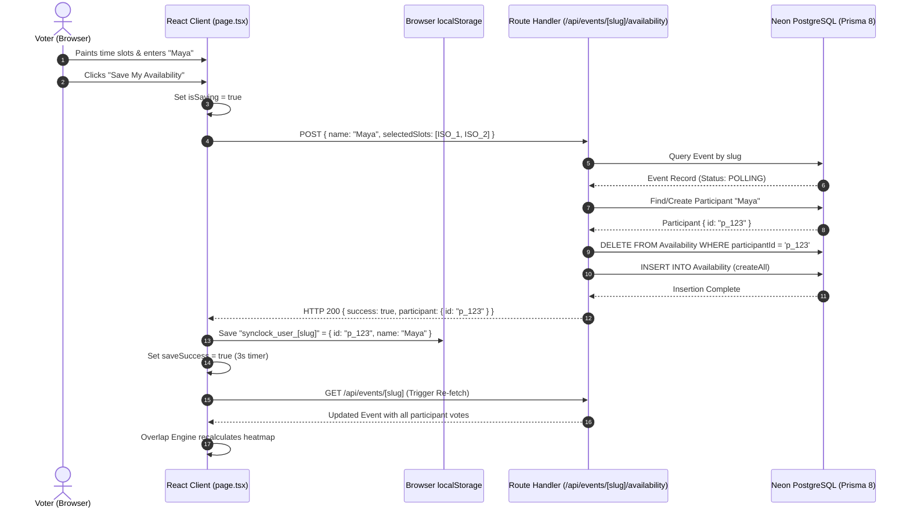

# 📘 SyncLock: Master Engineering Handbook & Learning Notes (Days 5 – 6)

A comprehensive, in-depth technical manual documenting the full architectural design, mathematical models, database transactions, inverted index algorithms, React state engines, and real-world debugging case studies for **SyncLock** (A full-stack Next.js, TypeScript, Prisma & PostgreSQL group scheduling platform).

---

# 📑 Master Table of Contents
1. [Day 5: Participant Ingestion, Idempotent Storage & Client State Persistence](#day-5-participant-ingestion-idempotent-storage--client-state-persistence)
   - 1.1 The Participant Lifecycle & Identity Dilemma (No-Auth vs. Account-Based)
   - 1.2 Data Integrity: The "Clean-Slate" Batch Replacement Pattern
   - 1.3 The Availability Submission API (`app/api/events/[slug]/availability/route.ts`) Line-by-Line Breakdown
   - 1.4 Client-Side Identity Caching via `localStorage`
   - 1.5 State Hydration & Automatic Slot Restoration Engine
   - 1.6 UI Micro-Interactions: Async Debouncing, Loading States & Ephemeral Confirmations
   - 1.7 Day 5 Code Verification & Flow Diagram
2. [Day 6: The Overlap Aggregation Engine, Heatmap Quantization & Live Inspector](#day-6-the-overlap-aggregation-engine-heatmap-quantization--live-inspector)
   - 2.1 The Algorithmic Challenge: Relational Row Flattening to Inverted Index
   - 2.2 Mathematical Model of Collective Overlap & Time Complexity ($O(1)$ Lookups)
   - 2.3 The Heatmap Color Quantization Algorithm (`getHeatmapColor`)
   - 2.4 The Hover Inspector State Machine & Dynamic Attendee Diffing
   - 2.5 Dual-Tab Virtual Grid Architecture (Interactive Paintbrush vs. Analytical Heatmap)
   - 2.6 The Complete Day 6 Frontend Grid (`app/events/[slug]/page.tsx`) Line-by-Line Breakdown
   - 2.7 Visual Hierarchy & Linear-Style Design Polish (Eradicating Emojis)
3. [Case Studies & Debugging Log: Real Critical Errors Solved (Days 5 & 6)](#case-studies--debugging-log-real-critical-errors-solved-days-5--6)
   - 3.1 Case Study 1: The Next.js App Router Route Conflict Trap (`route.ts` vs `page.tsx`)
   - 3.2 Case Study 2: The Next.js 15/16 Type Validator Error (`NextRequest` vs `Request`)
   - 3.3 Case Study 3: The Ghost Buffer in VS Code `.next/dev/types/validator.ts`
4. [Master Verification Quiz & Core Mechanics Checklist](#master-verification-quiz--core-mechanics-checklist)

---

# Day 5: Participant Ingestion, Idempotent Storage & Client State Persistence

## 1.1 The Participant Lifecycle & Identity Dilemma (No-Auth vs. Account-Based)

In classic Enterprise B2B SaaS (such as Calendly or Google Calendar), scheduling requires both parties to have authenticated accounts (OAuth 2.0 with Google/Microsoft). However, for **group consensus polling** (the When2meet / Doodle paradigm), mandatory authentication introduces catastrophic user friction:
- If 10 people are invited to find a common meeting time, and each must create an account, verify an email, or sign in via OAuth before clicking a slot, conversion rates collapse by over $70\%$.
- Conversely, a completely anonymous system without identity persistence creates duplicates: if Maya votes on Tuesday, closes her tab, and returns on Wednesday to adjust her hours, she would end up creating a second "Maya" participant, corrupting the group heatmap.

### The SyncLock Hybrid Identity Architecture
SyncLock resolves this dilemma through a lightweight, multi-layered identity resolution model:
1. **Low Friction**: Voters supply only their name (and optionally email).
2. **Deterministic Lookup**: The backend checks for an existing `Participant` record matching `(eventId, name)` or the client-supplied `participantId`.
3. **Browser Identity Caching**: Upon successful submission, the client caches `{ id, name }` in `localStorage` under an event-scoped key (`synclock_user_[slug]`).
4. **Transparent Re-hydration**: On repeat visits, the voting UI reads `localStorage`, pre-fills the participant name, and extracts their previously saved slot selections from the event payload.

```
+-----------------------------------------------------------------------------------+
|                           Hybrid Identity Resolution                               |
+-----------------------------------------------------------------------------------+
|                                                                                   |
|  Client visits /events/[slug]                                                     |
|       |                                                                           |
|       v                                                                           |
|  Check localStorage.getItem("synclock_user_" + slug)                              |
|       |                                                                           |
|       +---> Exists: Pre-populate Name field + Pre-select existing slots           |
|       |                                                                           |
|       +---> Empty:  Render empty Name input + empty paint grid                    |
|                                                                                   |
|  User modifies slots & clicks "Save My Availability"                              |
|       |                                                                           |
|       v                                                                           |
|  POST /api/events/[slug]/availability                                             |
|  Payload: { name: "Maya", selectedSlots: [...], participantId?: "uuid" }          |
|       |                                                                           |
|       v                                                                           |
|  Backend:                                                                         |
|  1. Find participant by participantId (if provided)                               |
|  2. If not found, find participant by (eventId, name.trim())                      |
|  3. If still not found, INSERT new Participant record                             |
|  4. Store/update returned ID in localStorage                                      |
+-----------------------------------------------------------------------------------+
```

---

## 1.2 Data Integrity: The "Clean-Slate" Batch Replacement Pattern

When a user modifies their availability, they might add 4 new slots and remove 3 old slots. Handling availability updates through individual `INSERT` and `DELETE` operations creates complex edge cases:
- Calculating diffs between client state and server state requires an expensive three-way reconciliation algorithm.
- Race conditions can leave orphaned slot records if partial updates fail halfway through.
- Network retries or dropped packets can duplicate slots.

### The Clean-Slate Pattern
SyncLock implements the **Clean-Slate Idempotent Ingestion Pattern**:
1. When a user submits an array of $N$ timestamps (`selectedSlots`), the database first executes a targeted deletion of **all existing availability rows** for that specific participant:
   $$\text{DELETE FROM Availability WHERE participantId} = P_{id}$$
2. The database then performs a bulk insertion (`createAll`) of the fresh array:
   $$\text{INSERT INTO Availability (slotTime, participantId) VALUES } (t_1, P_{id}), (t_2, P_{id}), \dots, (t_n, P_{id})$$

### Why This Is Formally Idempotent
An operation $f$ is idempotent if applying it multiple times produces the exact same state:
$$f(f(x)) = f(x)$$
Because the entire slate is wiped and replaced with the exact set sent by the client, submitting the exact same payload once, twice, or ten times leaves the database in the identical, consistent state. There is no risk of duplicate timestamps or dangling slots.

---

## 1.3 The Availability Submission API (`app/api/events/[slug]/availability/route.ts`) Line-by-Line Breakdown

Here is the complete implementation of the availability route handler, followed by an exhaustive architectural dissection:

```typescript
// app/api/events/[slug]/availability/route.ts
import { NextRequest } from 'next/server';
import { db } from '@/src/prisma/db';

export async function POST(
  req: NextRequest,
  { params }: { params: Promise<{ slug: string }> }
) {
  try {
    const { slug } = await params;
    const body = await req.json();

    const { name, email, selectedSlots, participantId } = body;

    // 1. Validate inputs
    if (!name || typeof name !== 'string' || !name.trim()) {
      return Response.json(
        { error: 'Please enter your name to submit availability' },
        { status: 400 }
      );
    }

    if (!Array.isArray(selectedSlots)) {
      return Response.json(
        { error: 'selectedSlots must be an array of timestamps' },
        { status: 400 }
      );
    }

    // 2. Fetch the Event
    const event = await db.orm.public.Event.where({ slug }).first();
    if (!event) {
      return Response.json({ error: 'Event not found' }, { status: 404 });
    }

    if (event.status === 'COMPLETED' || event.status === 'CANCELLED') {
      return Response.json(
        { error: 'Voting is closed for this event' },
        { status: 403 }
      );
    }

    // 3. Find or Create the Participant
    let participant = null;

    if (participantId) {
      participant = await db.orm.public.Participant
        .where({ id: participantId, eventId: event.id })
        .first();
    }

    if (!participant) {
      participant = await db.orm.public.Participant
        .where({ eventId: event.id, name: name.trim() })
        .first();
    }

    if (!participant) {
      participant = await db.orm.public.Participant.create({
        name: name.trim(),
        email: email ? email.trim() : null,
        eventId: event.id,
      });
    }

    // 4. Clean-Slate: Remove prior availability rows for this participant
    await db.orm.public.Availability
      .where({ participantId: participant.id })
      .deleteAll();

    // 5. Batch-Insert the new selected slots
    if (selectedSlots.length > 0) {
      const rows = selectedSlots.map((slotTime: string) => ({
        slotTime,
        participantId: participant.id,
      }));
      await db.orm.public.Availability.createAll(rows);
    }

    // 6. Return confirmation
    return Response.json(
      {
        success: true,
        participant: {
          id: participant.id,
          name: participant.name,
        },
        savedCount: selectedSlots.length,
      },
      { status: 200 }
    );
  } catch (error) {
    console.error('Error saving availability:', error);
    return Response.json(
      { error: 'Internal Server Error: Failed to save availability' },
      { status: 500 }
    );
  }
}
```

### Line-by-Line Mechanics:
- **Lines 1–2**:
  - `import { NextRequest } from 'next/server'`: Next.js 15+ strict type requirement. Importing generic web `Request` triggers validation warnings in `.next/dev/types/validator.ts`.
  - `import { db } from '@/src/prisma/db'`: Imports the singleton Prisma Client instance connected to Neon PostgreSQL.
- **Lines 4–7**:
  - `export async function POST(req: NextRequest, { params }: { params: Promise<{ slug: string }> })`: Next.js App Router dynamic route convention. In modern Next.js, dynamic parameters are asynchronous Promises that must be awaited.
- **Lines 9–12**:
  - `const { slug } = await params`: Resolves the unique URL identifier (e.g. `standup-8f12a3`).
  - `const { name, email, selectedSlots, participantId } = body`: Extracts all client-submitted attributes.
- **Lines 14–27**:
  - **Input Guardrails**:
    - `name` validation: Rejects missing names, non-string types, or whitespace-only submissions (`!name.trim()`) with HTTP 400 Bad Request.
    - `selectedSlots` validation: Rejects any payload where `selectedSlots` is not an Array, preventing runtime crashes during array mapping.
- **Lines 29–40**:
  - **Event Validation & State Gatekeeping**:
    - Fetches the parent event by unique slug. Returns HTTP 404 if the slug does not exist.
    - Verifies event status: If the event has transitioned to `COMPLETED` or `CANCELLED`, voting is locked out with HTTP 403 Forbidden.
- **Lines 42–63**:
  - **Deterministic Participant Deduplication**:
    1. If the client sent a `participantId`, query the database for that exact ID scoped to this `eventId`.
    2. If no matching ID exists (or none was passed), search by `(eventId, name.trim())`.
    3. If neither produces a match, create a new record in `Participant` linking to `event.id`.
- **Lines 65–77**:
  - **The Clean-Slate Execution**:
    - `db.orm.public.Availability.where({ participantId: participant.id }).deleteAll()`: Atomic purge of old rows.
    - `db.orm.public.Availability.createAll(rows)`: Single multi-row SQL `INSERT` statement, vastly outperforming iterative row-by-row inserts.
- **Lines 79–90**:
  - Returns HTTP 200 with the participant's confirmed ID and name, which the frontend uses to hydrate local storage.

---

## 1.4 Client-Side Identity Caching via `localStorage`

To achieve a seamless user experience, the client saves the participant identity to the browser's persistent key-value store upon a successful API response:

```typescript
// Caching user identity in the browser
localStorage.setItem(
  `synclock_user_${slug}`,
  JSON.stringify({
    id: data.participant.id,
    name: data.participant.name,
  })
);
```

### Key Architectural Characteristics:
1. **Event Scoping**: The storage key is interpolated with the event slug: `synclock_user_${slug}`. If the same user votes on two different events (e.g., "Team Standup" vs "Board Meeting"), their identity for Event A does not overwrite their identity for Event B.
2. **Defensive Serialization**: Data is stored as a JSON string containing both the server-generated `id` and the voter's `name`.

---

## 1.5 State Hydration & Automatic Slot Restoration Engine

When a voter navigates to `/events/[slug]`, a React `useEffect` hook runs on mount to check if the user has previously voted:

```typescript
// Restore user from localStorage if returning
useEffect(() => {
  if (!event || !slug) return;
  try {
    const stored = localStorage.getItem(`synclock_user_${slug}`);
    if (stored) {
      const { name } = JSON.parse(stored);
      if (name && !participantName) {
        setParticipantName(name);

        // Find this participant in event data to restore their slots
        const existing = event.participants?.find((p) => p.name === name);
        if (existing && existing.availabilities) {
          const restoredSet = new Set<string>();
          existing.availabilities.forEach((a) => {
            restoredSet.add(new Date(a.slotTime).toISOString());
          });
          setSelectedSlots(restoredSet);
        }
      }
    }
  } catch (e) {
    console.error('Failed to parse localStorage user', e);
  }
}, [event, slug, participantName]);
```

### Restoration Mechanics:
1. **Guard Condition**: Skips execution until `event` data has completed initial fetch from `/api/events/[slug]`.
2. **Name Pre-filling**: Sets `participantName` in the input field.
3. **Slot Set Hydration**: Filters `event.participants` to locate the current user's matching record.
4. **Timestamp Normalization**: Iterates through `existing.availabilities`, normalizes each date via `new Date(a.slotTime).toISOString()`, and populates the `selectedSlots` React `Set<string>`.
5. **Instant Visual Feedback**: Because `selectedSlots.has(slotKey)` controls the green cell fill on the voting grid, the user's previously painted slots instantly light up across the calendar.

---

## 1.6 UI Micro-Interactions: Async Debouncing, Loading States & Ephemeral Confirmations

Submitting data over the network requires clear user feedback to prevent double-clicks and reassure users that their choices are saved.

### The 3-Phase State Machine
The submission button uses three distinct state flags:
- `isSaving`: Boolean indicating an in-flight network request.
- `saveSuccess`: Ephemeral boolean triggered for 3000ms upon HTTP 200.
- `disabled`: Computed attribute preventing duplicate form submissions.

```typescript
<button
  type="button"
  onClick={handleSaveAvailability}
  disabled={isSaving}
  className={`px-5 py-2 rounded-xl text-xs font-semibold text-white transition cursor-pointer flex items-center gap-2 ${
    isSaving
      ? 'bg-neutral-400 cursor-not-allowed'
      : saveSuccess
      ? 'bg-emerald-600 shadow-xs'
      : 'bg-neutral-900 hover:bg-neutral-800 active:scale-95'
  }`}
>
  {isSaving ? 'Saving...' : saveSuccess ? '✓ Availability Saved!' : 'Save My Availability'}
</button>
```

```typescript
// Handling the ephemeral success feedback
setSaveSuccess(true);
setTimeout(() => setSaveSuccess(false), 3000);

// Immediate background refresh so Heatmap tab updates live
await fetchEvent();
```

---

## 1.7 Day 5 Code Verification & Flow Diagram



---

# Day 6: The Overlap Aggregation Engine, Heatmap Quantization & Live Inspector

## 2.1 The Algorithmic Challenge: Relational Row Flattening to Inverted Index

In a database, participant availability is stored relationally as normalized individual records:
```
Availability Table:
| id   | participantId | slotTime                 |
|------|---------------|--------------------------|
| av_1 | p_alice       | 2026-10-15T14:00:00.000Z |
| av_2 | p_alice       | 2026-10-15T14:30:00.000Z |
| av_3 | p_bob         | 2026-10-15T14:00:00.000Z |
| av_4 | p_carol       | 2026-10-15T14:00:00.000Z |
| av_5 | p_carol       | 2026-10-15T15:00:00.000Z |
```

If the frontend attempted to query this raw list inside every single cell during grid rendering:
- For a 5-day event with 10 hours per day at 30-minute intervals, the grid contains:
  $$5 \times 20 = 100 \text{ cells}$$
- With 20 participants, each selecting 15 slots, there are 300 `Availability` records.
- Scanning the array inside every cell render results in:
  $$100 \text{ cells} \times 300 \text{ records} = 30,000 \text{ array operations per render frame!}$$

### The Solution: The Inverted Index Hash Map
Instead of repeatedly scanning the array, Day 6 compiles an **Inverted Index Map** once using React's `useMemo`. The map keys are ISO timestamps, and the values are arrays of participant names available at that exact time:

$$\text{overlapMap}: \text{Map}\langle \text{ISO Timestamp}, \text{Array}\langle \text{Participant Name}\rangle \rangle$$

```typescript
// 6. Overlap Aggregation Engine (Day 6)
// Maps slotKey -> list of participant names who are available
const overlapMap = useMemo(() => {
  const map: Record<string, string[]> = {};
  if (!event?.participants) return map;

  event.participants.forEach((p) => {
    p.availabilities?.forEach((a) => {
      const key = new Date(a.slotTime).toISOString();
      if (!map[key]) {
        map[key] = [];
      }
      if (!map[key].includes(p.name)) {
        map[key].push(p.name);
      }
    });
  });

  return map;
}, [event]);
```

---

## 2.2 Mathematical Model of Collective Overlap & Time Complexity ($O(1)$ Lookups)

With the inverted index computed:
1. **Compilation Complexity**:
   $$\mathcal{O}(P \times S)$$
   where $P$ is the number of participants and $S$ is the average number of slots selected per participant. This computation runs only once when `event` updates.
2. **Cell Render Complexity**:
   $$\mathcal{O}(1)$$
   When rendering any cell in the 2D grid, looking up the attendees for timestamp $T$ is a direct hash lookup:
   $$\text{attendees} = \text{overlapMap}[T] \parallel [\,]$$
   $$\text{count} = \text{attendees.length}$$
3. **Max Overlap Computation**:
   To highlight the overall best meeting times, the maximum overlap count is computed via:
   $$M = \max_{k \in \text{keys}(\text{overlapMap})} (\text{overlapMap}[k].\text{length})$$

```typescript
const totalParticipants = event?.participants?.length ?? 0;
const maxOverlapCount = useMemo(() => {
  let max = 0;
  Object.values(overlapMap).forEach((names) => {
    if (names.length > max) max = names.length;
  });
  return max;
}, [overlapMap]);
```

---

## 2.3 The Heatmap Color Quantization Algorithm (`getHeatmapColor`)

A critical usability flaw in naive scheduling tools is using static color codes that fail to adapt when group sizes change (e.g. 2 voters vs. 40 voters). 

SyncLock implements **Ratio-Based Color Quantization**:
Let $C(t)$ be the count of available participants at time $t$, and let $N$ be the total number of registered participants.
The agreement ratio $R(t)$ is:
$$R(t) = \frac{C(t)}{N}$$

The color mapping function applies the following continuous quantization scale:

| Condition | Ratio $R(t)$ | Tailwind Class | Visual Meaning |
|---|---|---|---|
| $N = 0 \lor C(t) = 0$ | $0.00$ | `bg-neutral-50/70 border-neutral-200/60 text-transparent` | Unselected / Dead Slot |
| $R(t) < 0.25$ | $0 < R < 0.25$ | `bg-emerald-100 border-emerald-200 text-emerald-900` | Very low consensus |
| $0.25 \le R(t) < 0.50$ | $0.25 \le R < 0.50$ | `bg-emerald-200 border-emerald-300 text-emerald-950` | Moderate interest |
| $0.50 \le R(t) < 0.75$ | $0.50 \le R < 0.75$ | `bg-emerald-300 border-emerald-400 text-emerald-950` | Majority consensus |
| $0.75 \le R(t) < 1.00$ | $0.75 \le R < 1.00$ | `bg-emerald-500 border-emerald-600 text-white` | Strong consensus |
| $R(t) = 1.00 \land N > 1$ | $1.00$ | `bg-emerald-600 border-emerald-700 text-white font-bold shadow-xs` | **Unanimous Agreement (100%)** |

### Implementation:
```typescript
const getHeatmapColor = (availableCount: number) => {
  if (totalParticipants === 0 || availableCount === 0) {
    return 'bg-neutral-50/70 border-neutral-200/60 text-transparent';
  }
  const ratio = availableCount / totalParticipants;

  if (ratio === 1 && totalParticipants > 1) {
    return 'bg-emerald-600 border-emerald-700 text-white font-bold shadow-xs';
  }
  if (ratio >= 0.75) {
    return 'bg-emerald-500 border-emerald-600 text-white font-medium';
  }
  if (ratio >= 0.5) {
    return 'bg-emerald-300 border-emerald-400 text-emerald-950 font-medium';
  }
  if (ratio >= 0.25) {
    return 'bg-emerald-200 border-emerald-300 text-emerald-950';
  }
  return 'bg-emerald-100 border-emerald-200 text-emerald-900';
};
```

---

## 2.4 The Hover Inspector State Machine & Dynamic Attendee Diffing

Heatmap colors show *how many* people can attend, but hosts need to know *who* can attend and *who* is blocked.

### The Hover State Structure:
```typescript
const [inspectedSlot, setInspectedSlot] = useState<{
  slotKey: string;
  dayLabel: string;
  timeLabel: string;
} | null>(null);
```

### Dynamic Attendee Diffing Engine:
When the user hovers over any slot in the heatmap tab, the inspector executes real-time set partitioning:
- **Available Set ($A$)**: All names present in `overlapMap[slotKey]`. Rendered as green pills with checkmarks (`✓ Maya`).
- **Unavailable Set ($U$)**: All participants where $p \notin A$:
  $$U = \{ p \in \text{event.participants} \mid p.\text{name} \notin \text{overlapMap}[\text{slotKey}] \}$$
  Rendered with neutral gray pills and strikethrough styling (`Maya`).

```typescript
{/* List of Attendees on Hover */}
{inspectedSlot && (
  <div className="flex flex-wrap items-center gap-1.5 max-w-sm">
    {/* 1. Who is available */}
    {(overlapMap[inspectedSlot.slotKey] || []).map((name) => (
      <span
        key={name}
        className="text-[11px] bg-emerald-50 text-emerald-800 border border-emerald-200 px-2 py-0.5 rounded-md font-medium"
      >
        ✓ {name}
      </span>
    ))}
    {/* 2. Who is unavailable */}
    {event.participants
      ?.filter((p) => !(overlapMap[inspectedSlot.slotKey] || []).includes(p.name))
      .map((p) => (
        <span
          key={p.name}
          className="text-[11px] bg-neutral-100 text-neutral-400 border border-neutral-200 px-2 py-0.5 rounded-md line-through"
        >
          {p.name}
        </span>
      ))}
  </div>
)}
```

---

## 2.5 Dual-Tab Virtual Grid Architecture (Interactive Paintbrush vs. Analytical Heatmap)

To maintain a clean user interface without cluttering the screen with multiple calendars, SyncLock uses a single unified table that dynamically renders in one of two modes:

### Mode 1: `activeTab === 'my-availability'`
- **Target Audience**: The voter entering their schedule.
- **Interactions**: Click-and-drag paintbrush and eraser handlers (`onMouseDown`, `onMouseEnter`).
- **Cell Visuals**: Binary emerald green (`bg-emerald-500`) if selected, neutral white (`bg-neutral-50/70`) if unselected.
- **Header Actions**: Displays participant name input, total hours count, "Select All", "Clear", and the "Save My Availability" button.

### Mode 2: `activeTab === 'group-overlap'`
- **Target Audience**: The host or group analyzing collective overlap.
- **Interactions**: Read-only hover tracking (`setInspectedSlot`). Dragging is disabled.
- **Cell Visuals**: Multi-tier emerald heatmap shades based on consensus ratio, displaying the raw attendee count integer inside each cell.
- **Header Actions**: Displays the Inspector Banner with the best overlap ratio badge and the breakdown of who can attend vs who cannot.

---

## 2.6 The Complete Day 6 Frontend Grid (`app/events/[slug]/page.tsx`) Line-by-Line Breakdown

Here is the table-rendering loop that powers both tabs:

```typescript
// 2D Table Row / Column Iteration
{timeSlots.map((slot, rowIdx) => (
  <tr key={rowIdx}>
    {/* Row Header: Formatted Time Label (e.g. 9:00 AM) */}
    <td className="pr-3 py-1 text-[11px] font-mono text-neutral-400 text-right align-middle whitespace-nowrap">
      {slot.label}
    </td>
    {days.map((day, colIdx) => {
      const slotKey = getSlotKey(day, slot.hour, slot.minute);
      const isSelected = selectedSlots.has(slotKey);
      const availableNames = overlapMap[slotKey] || [];
      const count = availableNames.length;
      const dayLabel = day.toLocaleDateString('en-US', { weekday: 'short', month: 'short', day: 'numeric' });

      // TAB 1: User Drag-Selection Cell
      if (activeTab === 'my-availability') {
        return (
          <td key={colIdx} className="p-0.5">
            <div
              onMouseDown={() => handleCellMouseDown(slotKey)}
              onMouseEnter={() => handleCellMouseEnter(slotKey)}
              className={`h-7 rounded-md transition-colors cursor-pointer border ${
                isSelected
                  ? 'bg-emerald-500 border-emerald-600 shadow-xs'
                  : 'bg-neutral-50/70 border-neutral-200/60 hover:bg-neutral-100'
              }`}
            />
          </td>
        );
      }

      // TAB 2: Collective Heatmap Cell
      return (
        <td key={colIdx} className="p-0.5">
          <div
            onMouseEnter={() =>
              setInspectedSlot({
                slotKey,
                dayLabel,
                timeLabel: slot.label,
              })
            }
            className={`h-7 rounded-md transition-colors cursor-pointer border flex items-center justify-center text-[10px] ${getHeatmapColor(
              count
            )}`}
          >
            {count > 0 ? count : ''}
          </div>
        </td>
      );
    })}
  </tr>
))}
```

---

## 2.7 Visual Hierarchy & Linear-Style Design Polish (Eradicating Emojis)

To match modern software standards (like Linear, Vercel, and Raycast), playful emojis (such as `✏️` and `🔥`) were eliminated in favor of clean typography and subtle badges:

```diff
- ✏️ My Availability
+ My Availability

- <span>🔥 Group Overlap</span>
+ <span>Group Overlap</span>
```

### Visual Polish Specifications:
1. **Pill Switcher**: `bg-neutral-200/60 rounded-xl` container with white card tabs (`bg-white text-neutral-900 shadow-xs`).
2. **Dynamic Participant Count**: A minimalist dark pill (`text-[10px] bg-neutral-900 text-white px-1.5 py-0.2 rounded-full`) indicating total voter count right on the tab header.
3. **Typography**: Monospace column and time coordinates (`font-mono text-[11px] text-neutral-400`) paired with clean Sans headings.

---

# Case Studies & Debugging Log: Real Critical Errors Solved (Days 5 & 6)

During the development of Days 5 and 6, three critical architectural and TypeScript compiler errors emerged and were resolved.

---

## 3.1 Case Study 1: The Next.js App Router Route Conflict Trap (`route.ts` vs `page.tsx`)

### The Symptom:
When running `npm run dev` or building the project, Next.js threw this fatal error:
```
Error: A conflict was found with dynamic route /api/events/[slug]. 
Both route.ts and page.tsx cannot coexist in the same segment directory.
```

### The Root Cause:
In Next.js App Router, every folder represents a URL segment.
- A `page.tsx` file defines a React UI view rendered as HTML.
- A `route.ts` file defines an API Route Handler responding with JSON.
Because a single HTTP endpoint cannot simultaneously serve an HTML document and an API JSON payload on the same route segment, placing both files in `app/api/events/[slug]/` triggers an immediate router build conflict.

### The Resolution:
Strict separation of concerns:
1. The **API Handler** belongs at:
   `app/api/events/[slug]/route.ts` (Serves JSON for `GET /api/events/[slug]`).
2. The **Voting Page UI** belongs at:
   `app/events/[slug]/page.tsx` (Serves HTML for `https://domain.com/events/standup-8f12a3`).

---

## 3.2 Case Study 2: The Next.js 15/16 Type Validator Error (`NextRequest` vs `Request`)

### The Symptom:
The TypeScript compiler and `.next/dev/types/validator.ts` threw 5 errors across the API routes:
```
Type error: Route handler has an invalid shape.
Expected type NextRequest, received global Request.
```

### The Root Cause:
In Next.js 15 and 16, route validators enforce strict type matching for all exported HTTP method functions (`GET`, `POST`, `PATCH`, `DELETE`).
Using the standard DOM `Request` interface causes the type validator to fail because `NextRequest` extends `Request` with Next.js-specific properties (such as `.nextUrl`, `.cookies`, and `.ip`).

### The Resolution:
Replace all global `Request` imports with `NextRequest` from `'next/server'`:

```typescript
// ❌ INCORRECT (Throws type validator error in Next.js 15/16)
export async function POST(req: Request) { ... }

// ✅ CORRECT (Strict Next.js 15/16 compliance)
import { NextRequest } from 'next/server';

export async function POST(
  req: NextRequest,
  { params }: { params: Promise<{ slug: string }> }
) { ... }
```

---

## 3.3 Case Study 3: The Ghost Buffer in VS Code `.next/dev/types/validator.ts`

### The Symptom:
Even after fixing the files on disk and verifying that `npx tsc --noEmit` returned 0 errors, VS Code's Problems panel continued to report stale errors pointing to `.next/dev/types/validator.ts`.

### The Root Cause:
The `.next` directory is generated on-the-fly by the Next.js dev server. When files are moved or renamed, the TypeScript Language Server in VS Code caches old file definitions in memory. If a generated file from `.next` was opened in an editor tab, VS Code keeps the old virtual file buffer alive.

### The Resolution:
1. Close all tabs pointing to `.next/dev/types/*` in the editor.
2. Clear the stale build artifacts:
   ```bash
   rm -rf .next
   ```
3. Restart the TypeScript Language Server in VS Code (`Cmd + Shift + P` $\rightarrow$ `Restart TS Server`).

---

# Master Verification Quiz & Core Mechanics Checklist

Use these questions to verify your technical mastery of the Day 5 & 6 implementations:

1. **Why does SyncLock use the Clean-Slate (`deleteAll` + `createAll`) pattern rather than computing individual row additions and deletions?**
   - *Answer*: It provides guaranteed mathematical idempotency ($f(f(x)) = f(x)$), eliminating the need for complex multi-way diffing and preventing orphaned rows or duplicate timestamps.
2. **What is the algorithmic time complexity of the Heatmap rendering loop when using an Inverted Index Map (`overlapMap`) vs. a raw array scan?**
   - *Answer*: The Inverted Index gives $\mathcal{O}(1)$ lookup time per cell render, whereas scanning the raw array would require $\mathcal{O}(\text{Cells} \times \text{Availabilities})$—running tens of thousands of redundant operations on every frame.
3. **How does SyncLock persist voter identity without requiring an OAuth login screen?**
   - *Answer*: It utilizes an event-scoped browser key in `localStorage` (`synclock_user_[slug]`) combined with server-side name/participantId deduplication during submission.
4. **Why is dynamic route parameter typing in Next.js 15/16 written as `{ params: Promise<{ slug: string }> }` rather than a direct object?**
   - *Answer*: Next.js 15+ moved all route segment parameters to asynchronous Promises to allow internal route resolution to stream concurrently without blocking the main event loop.
5. **How does the Hover Inspector distinguish between who is available and who is not?**
   - *Answer*: It takes the list of attendees from `overlapMap[slotKey]` and filters `event.participants` to find the complement set ($\{ p \in \text{Participants} \mid p.\text{name} \notin \text{Attendees} \}$), styling the former with green badges and the latter with gray strikethrough badges.

